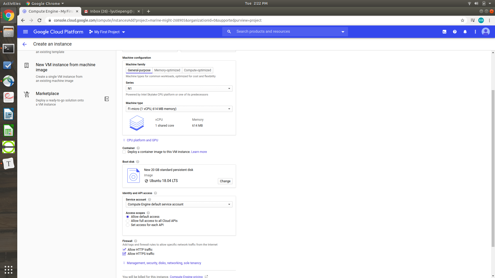
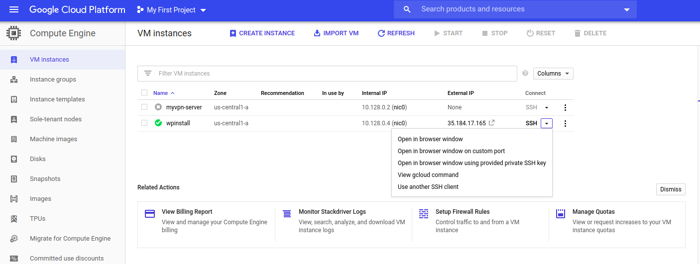

# Setup web host at Google Cloud

## 1. Add new VM instance

* Go to [Google Cloud Platform](console.cloud.google.com).

* At the left side, select `Compute Engine` from the `Navigation borad`.
* Create a new VM instances. 

## 2. `SSH` into newly created VM

* Choose one of the ways to `ssh` into the VM created at last step. 

* If you have installed `gcloud` on your local machine like me, you can click `View gcloud command` and paste the command into your terminal. Here, I am assuming you have installed. If not, you may find [this](https://snapcraft.io/install/google-cloud-sdk/ubuntu) and [this setup instruction](https://cloud.google.com/sdk/docs/quickstart-debian-ubuntu) helpful.

* Now, since we can `ssh` into the new VM, there are a couple of things to setup and check before heading on our web host. 

## 3. Add swapfile

```Terminal
# always update at the first time
sudo apt update && sudo apt upgrade

# (optioinal) check the available resources (CPU, RAM and SWAP)
htop

# allocate swapfile
sudo fallocate -l 1G /swapfile

sudo dd if=/dev/zero of=/swapfile bs=1024 count=1048576
sudo chmod 600 /swapfile

# make swap and turn it on
sudo mkswap /swapfile
sudo swapon /swapfile

# modify /etc/fstab
sudo nano /etc/fstab
# add "/swapfile swap swap defaults 0 0" at the end of /etc/fstab

# check errors
sudo mount -a

# (optional) check resource status
htop
```

## 4. Install LAMP

```Terminal
sudo apt install tasksel
sudo tasksel install lamp-server
sudo apt install php-curl php-gd php-mbstring php-xml php-xmlrpc
```

## 5. Setup LAMP

### 5.1 Setup Domain Name
```Terminal
# output the IP
curl ifconfig.me
```

Use the IP to set the host of your domain. Usually this is done at the console of domain name registrar where you buy your domain name from. For example, I bought the domain name [www.taipengliu.com](www.taipengliu.com) from [NameCheap](www.namecheap.com), so I can use my account to log and manage my domain name. 

  

### 5.2 Setup Domain name in Apache

```
cd /etc/apache2/sites-available/
sudo cp 000-default.conf [domain name].conf
```

Modify [domain name].conf

Uncomment `#ServerName www.example.com` and modify it into your domain name. You may also want to add `SeverAlias www.[domain name]` to deal with `www` stuff. Finally, add the following piece of code at the top

```
<Directory /var/www/html>
  Require all granted
</Directory>
```

Then, disable the default configuration and enable yours. 

```
a2dissite 000-default.conf
a2ensite [domain name].conf
systemctl reload apache2
```

### 5.3 Setup MySQL

Enter `mysql` mode:
```
mysql -u root
```

Inside `mysql` mode, type in:

```
CREATE DATABASE wordpress;
GRANT ALL ON wordpress.* TO 'wordpressuser' IDENTIFIED BY 'Secure1234!';
quit
```

Exit `mysql` program, and at the terminal, enter:

```
mysql_secure_installation
```

### 5.4 Setup PHP

```
cd /etc/php/7.2/apache2
vim php.ini
```

In `php.ini`, modify:

```
max_input_time = 30
upload_max_filesize = 20M
post_max_size = 21M
```

## 6. Install `WordPress`

```
cd /var/www/html/
mv index.html ..
wget https://wordpress.org/latest.tar.gz
tar -xvf latest.tar.gz
cd wordpress
mv * ..
rmdir wordpress/
rm latest.tar.gz
mv wp-config-sample.php wp-config.php
vim wp-config.php
```

Open `wp-config.php`, modify:

```
define( 'DB_NAME', 'wordpress');
...
define( 'DB_USER', 'wordpressuser')
...
define( 'DB_PASSWORD', 'Secure1234!')
...

```

Copy the content at  https://api.wordpress.org/secret-key/1.1/salt/ to the "Authentication Unique Keys and Salts" part. 

**Done setup**.

## 7. Optional
### 7.1 MPM config

```
vim /etc/apache2/mods-enabled/mpm_prefork.conf
```

Inside the file, modify to

```
<IfModule mpm_prefork_module>
        StartServers                     1
        MinSpareServers           2
        MaxSpareServers          5
        MaxRequestWorkers         10
        MaxConnectionsPerChild   1000
</IfModule>
```

### 7.2 Apache2buddy

```
cd ~
wget https://raw.githubusercontent.com/richardforth/apache2buddy/master/apache2buddy.pl
chmod +x apache2buddy.pl
# run to check settings
./apache2buddy.pl
```

## 8. Security

If you want a secure connection to your webpage, you may purchase SSL certificates. I paid $3.88/year for the product "positivessl" at NameCheap. If your web server is also Apache HTTP server, you may find [this link](https://www.namecheap.com/support/knowledgebase/article.aspx/9423/33/installing-an-ssl-certificate-on-apache/) helpful. 

## 9. Build up your fancy webpage!

Your site is ready for your creativity! Go and have fun developing your webpage!

## 10. Problems

### 10.1 Too many redirects

[This site]([https://www.liquidweb.com/kb/troubleshooting-too-many-redirects/#:~:text=The%20error%20%E2%80%9Ctoo%20many%20redirects,www%20forms%20of%20the%20URL.](https://www.liquidweb.com/kb/troubleshooting-too-many-redirects/#:~:text=The error "too many redirects,www forms of the URL.)) is of great help when I encountered "too many redirects" error. Two sites "www.taipengliu.com" and "taipengliu.com" are redirecting each other all the time, so the browser would should the error to prevent infinite loop consuming all resources of the system and letting your machine die out. I followed the instructions and finally it turned out that one of the MySQL tables "wp_options" get the wrong values. The site should name itself "www.taipengliu.com", but the values show "taipengliu.com" which will redirect clients to that site. However, by default configuration, the NameCheap redirect the non-www site to the www server. That the reason why they are trying to push direction to each other. 

### 10.2 More notes about redirections

For my domain name taipeng.com, there are **four** sites involved:

> http://taipengliu.com (we call it site1)<br>
> http://www.taipengliu.com (site2)<br>
> https://taipengliu.com (site3)<br>
> https://www.taipengliu.com (site4)

Currently, my host server is listening at site2:80 and site4:443. The NameCheap DNS server is redirecting site1 to site4. 

There are still two missions:

* modify my Apache server to redirect site2:80 to site4:443;
* find a way to redirect site3 to site4.

The first problem is solved by modifying the database like what I did in section 10.1. 

The second is not solved yet. I am not going to spend a lot of time here, because unless the users type in exactly "https://taipengliu.com" into their browser, they will always go to site4 and see the correct content.

### 10.3 Skip FTP login

Problem description: I am having difficulties in accessing the remote file system by FTP. I tried to setup FTP server `vsftpd` at the VM, and also created a FTP user, but I couldn't `ftp` into it by neither typing in the domain name nor external IP address. 

Solution: Honestly, I am still having that problem, but I found a way to skip the FTP login procedure to update WordPress or new plugins. I tried [this approach](https://www.hongkiat.com/blog/update-wordpress-without-ftp/) and it works pretty good. The method is to add one line of code at the end of file `mp-config.php`.
```
define('FS_METHOD','direct');
```

*Note*: please use `sudo chmod -R 777 *` to allow any access (r/w/x) to all files in your WordPress root directory. This may be danguagous, so please use `chmod` again after you have updated everything to protect your data.

### 10.4 Remove "Powered by WordPress"

Go to `wp-content/themes/[your theme]/footer.php` and modify it.

### 10.5 Include `.ipynb` file to WordPress

See instructions [here](https://www.eg.bucknell.edu/~brk009/notebook-on-wp/).